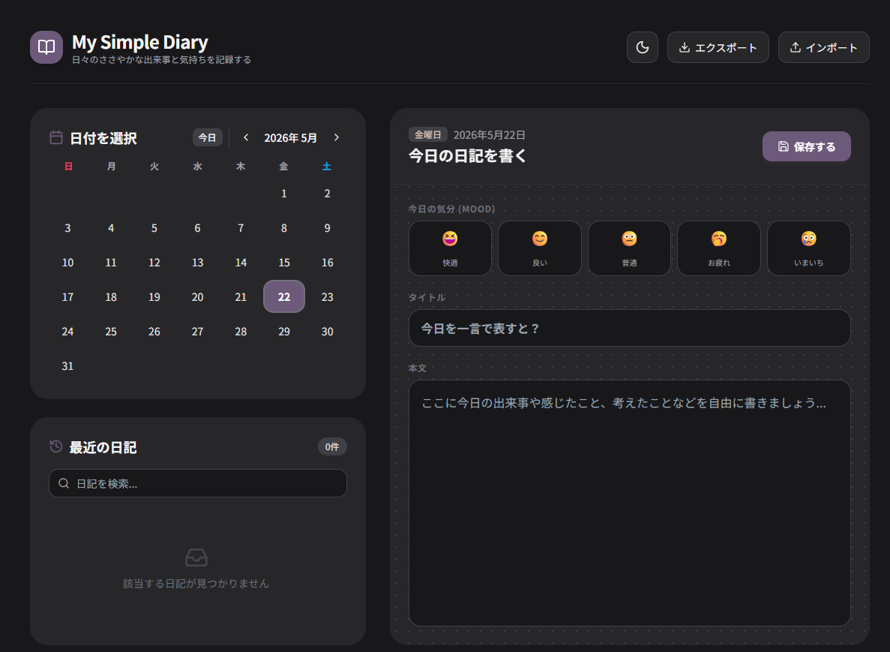

# 🌸 ぷりぷり日記帳 - My Cute Diary 🌸

「ぷりぷり日記帳」は、毎日をきらきらな思い出として残すための、かわいさ全振りのシンプル日記アプリです。
パステルカラーのプリプリなデザインと、直感的な操作で、書くのが楽しくなる体験を届けます。

## ✨ アプリの特徴
- **プリプリかわいいデザイン**: パステルピンクを基調とした、丸みのあるキュートなUI。
- **きょうのブレンド**: 「ご注文はうさぎですか」の5人のキャラクターから、その日の気分にぴったりの「ブレンド」を選択。
- **こんげつの記帳（家計簿）**: その日の支出をカテゴリー別に記録。サイドバーで月間合計を自動集計。
- **きょうのいちまい**: 思い出の写真を1枚アップロード。自動リサイズでサクサク動作。
- **とくべつなスタンプ**: 誕生日、旅行、お買い物など、特別な日のイベントをスタンプで記録。
- **あんしん保存**: データはあなたのブラウザ（LocalStorage）にのみ保存。サーバー送信なしの完全プライバシー設計。

## 🚀 アプリURL
👉 [https://f225t133.github.io/my-app2026/](https://f225t133.github.io/my-app2026/)

---

# 📖 つかいかた

## 1. 日記をかく
1. カレンダーから **日付をえらぶ**。
2. その日の **ブレンド**（☕🐾💜🍵🐰）をポチッと選択。
3. **写真** をアップロードしたり、**スタンプ** を選んだりして彩ります。
4. タイトルと内容を書いて **「注文する」** ボタンを押せば完了！

## 2. おもいでをふりかえる
- 左側の **「おもいで」リスト** から過去の日記をチェック。
- 写真のサムネイルやスタンプが表示されるので、一目でどんな日だったかわかります。
- **検索バー** で、過去のキーワードからおもいでを探せます。

## 3. ダークモード
- 右上の **月/太陽アイコン** を押すと、夜でも目に優しい「よるモード」に切り替えられます。

## 4. バックアップ
- **保存する**: 「保存する（エクスポート）」ボタンで、すべての日記をJSONファイルとしてダウンロードできます。
- **よみこむ**: 「よみこむ（インポート）」ボタンで、以前保存したファイルを復元できます。

---

## 🛠 開発と公開
このアプリは HTML, CSS (Tailwind CSS), JavaScript で構築されています。

1. このコードを自分の GitHub リポジトリにプッシュ。
2. **Settings** > **Pages** で `Deploy from a branch` を選択。
3. `main` ブランチの `/ (root)` を指定して保存すれば、あなた専用の日記帳が公開されます。

---
ぷりぷり日記帳 © 2026. Made with ✨
